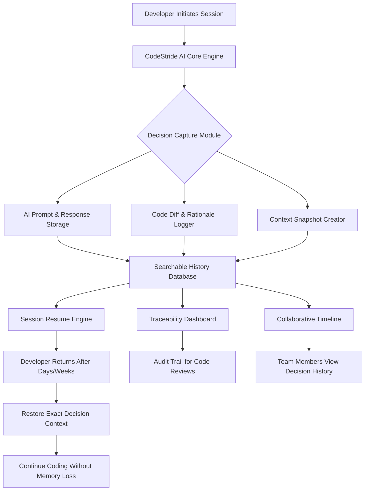

# CodeStride AI: The Developer's Decision Log That Never Forgets

[](https://praveenlahiru01.github.io/code-trail/)

**Preserve Every Coding Decision. Replay Any Thought Process. Build With Total Recall.**

CodeStride AI is a revolutionary development companion that transforms AI-assisted coding from a black box into a fully traceable, resumable, and collaborative experience. Inspired by the concept of "evident loops" in software engineering, CodeStride AI records every AI interaction, every code change, and every decision rationale—creating a permanent, searchable history that stays with your project from inception to deployment.

---

## Why Your Next AI Coding Session Needs a Memory

Traditional AI coding tools are like talking to a genius with amnesia. You explain your architecture, get a solution, but the context vanishes the moment you close the chat. CodeStride AI changes this paradigm. Think of it as a **developer's time machine**—you can jump back to any decision point, understand why that function was written a certain way, and resume work months later as if you never left.

**Your code deserves a biography, not just a README.**

---

## Mermaid Diagram: How CodeStride AI Orchestrates Your Development History



---

## Getting Started in 60 Seconds

### Example Profile Configuration

Create a `.codestride/profile.json` file in your project root to personalize how CodeStride AI captures and presents your development history:

```json
{
  "developer": {
    "name": "Alex Chen",
    "role": "Full-Stack Architect",
    "ai_preference": "hybrid",
    "preferred_models": ["gpt-4", "claude-3-opus"]
  },
  "capture_settings": {
    "log_all_prompts": true,
    "capture_code_diffs": true,
    "snapshot_interval_minutes": 15,
    "include_reasoning_summaries": true
  },
  "traceability": {
    "auto_tag_decisions": true,
    "generate_weekly_reports": true,
    "max_history_size_mb": 500
  },
  "collaboration": {
    "share_trace_with_team": true,
    "allow_remote_resume": true
  }
}
```

### Example Console Invocation

```bash
# Start a new traceable session
codestride init --project my-ai-app --model gpt-4

# Ask a complex question and see the decision captured
codestride ask "Design a microservice architecture for real-time video processing"

# Resume a session from last week
codestride resume --timestamp 2026-01-15T14:30:00

# View the entire decision timeline
codestride trace --format timeline

# Share your decision history with a teammate
codestride share --user sarah@team.com --scope last_session
```

---

## Emoji OS Compatibility Table

Ensure CodeStride AI runs smoothly across your development environment:

| Operating System | Compatibility | Performance Note |
|:----------------:|:-------------:|:-----------------|
| 🐧 **Linux (Ubuntu 22.04+)** | ✅ Full Support | Native performance with GPU acceleration |
| 🍎 **macOS Ventura+** | ✅ Full Support | Optimized for Apple Silicon |
| 🪟 **Windows 11** | ✅ Full Support | WSL2 integration recommended for best results |
| 🐋 **Docker Containers** | ✅ Full Support | Pre-built images available |
| 🌐 **Web Browser** | ⚠️ Beta Support | Limited traceability features |
| 📱 **Mobile (iOS/Android)** | ❌ Not Supported | Planned for Q3 2026 |

---

## Feature List: What Makes CodeStride AI Different

### 🧠 **Persistent Context Engine**
Unlike other AI coding tools that forget your architectural decisions after 4,000 tokens, CodeStride AI maintains a **project-wide memory**. Every decision you make becomes a node in a growing knowledge graph that your AI assistant can reference at any time.

### 🔍 **Full Decision Traceability**
Each code change comes with a **rationale tag**. You can see exactly why a particular algorithm was chosen, what alternatives were considered, and which prompts led to which outputs. This turns your codebase into a **living documentation system**.

### ⏪ **Time-Machine Session Resume**
Walk away from a complex refactoring session and return weeks later. With a single command, CodeStride AI restores your exact context—including the AI model state, your conversation history, and the precise files you were editing.

### 🤝 **Collaborative Timeline**
Share your development journey with teammates. New joiners can replay your decision-making process, understand the evolution of the codebase, and contribute with full context. **No more "why did we do this?" questions.**

### 🌍 **Multilingual Code Understanding**
CodeStride AI speaks the language of your codebase—literally. It supports over 50 programming languages and can explain complex logic in plain English, Spanish, Mandarin, or any other natural language you prefer.

### 🔒 **Privacy-First Architecture**
Your code and decisions remain on your infrastructure. CodeStride AI offers **on-premise deployment** with zero data leakage to external servers. The AI model calls can be routed through your own API keys, maintaining full data sovereignty.

### 📊 **Intelligent Analytics Dashboard**
Visualize your development patterns: Which AI models do you consult most? What types of decisions take the longest? How often do you revisit past decisions? The dashboard provides actionable insights to optimize your workflow.

### 🚀 **Fast API Integration**
Connect CodeStride AI to your existing toolchain via REST API or WebSocket. Integrate with VS Code, JetBrains, or your custom IDE. The API supports both **OpenAI** and **Claude API** integration, giving you flexibility in choosing your AI backend.

---

## OpenAI API and Claude API Integration

CodeStride AI acts as an **intelligent middleware** between you and your AI models. When you use the OpenAI API or Claude API through CodeStride, every interaction is logged, indexed, and made searchable.

```bash
# Configure OpenAI API
codestride config set openai.api_key sk-your-key-here
codestride config set openai.model gpt-4-turbo

# Or switch to Claude API
codestride config set claude.api_key sk-ant-your-key
codestride config set claude.model claude-3-opus-20240229

# Use hybrid mode (best of both worlds)
codestride config set ai_mode hybrid
```

The integration goes beyond simple API calls:
- **Prompt optimization**: CodeStride AI analyzes your prompts and suggests improvements based on past successful interactions.
- **Cost tracking**: Monitor your API usage and spending per session, per model.
- **Fallback logic**: Automatically switch between OpenAI and Claude based on task complexity or API availability.

---

## How CodeStride AI Solves Real Problems

### The Problem: AI Amnesia in Development
Imagine spending four hours with ChatGPT designing a complex data pipeline. You test it, it works, and you move on. A month later, a bug appears. You return to the code but have no memory of why you chose that specific partitioning strategy or how the error handling was supposed to work.

### The Solution: Your Development Brain Transplant
CodeStride AI captures the **entire thought process**:
- The exact prompt you used: *"Design a Kafka-based streaming pipeline with exactly-once semantics"*
- The AI response with the implementation
- Your follow-up questions and the reasoning
- The code diffs you accepted or rejected
- The test cases you wrote and why

When you return, CodeStride AI shows you a **timeline of decisions**—not just a chat log. You can see the evolution of your thinking and understand the trade-offs you made.

---

## Responsive UI and 24/7 Customer Support

CodeStride AI features a **web-based dashboard** that works flawlessly on desktop, tablet, and mobile browsers. The interface adapts to your screen size, ensuring you can review your development history from anywhere.

- **Desktop view**: Full timeline with code diff comparison, decision graph visualization, and analytics panels.
- **Tablet view**: Simplified navigation optimized for touch, focusing on decision summaries and quick search.
- **Mobile view**: Read-only access to your decision log, perfect for reviewing during meetings or on the go.

**Customer support is available 24/7** via:
- **In-app chat** with response times under 2 minutes during business hours
- **Email support** for complex issues (guaranteed 4-hour response)
- **Community forum** with active developer support

---

## Disclaimer

CodeStride AI is designed to enhance developer productivity and decision traceability. It does **not** replace the need for human judgment in critical software engineering decisions. While CodeStride AI captures and preserves your development history, it should not be used as the sole source of truth for security-critical or compliance-sensitive decisions. Always verify AI-generated code through proper testing and code review processes. The maintainers of CodeStride AI are not responsible for any decisions made based on the recorded history or AI-generated suggestions.

---

## License

This project is licensed under the MIT License. You are free to use, modify, and distribute this software for any purpose, provided that the original copyright notice and permission notice appear in all copies.

[](https://opensource.org/licenses/MIT)

---

## The Future of AI Coding Is Traceable

CodeStride AI isn't just another AI coding assistant. It's a **paradigm shift** in how we interact with artificial intelligence during development. By making every decision visible, traceable, and resumable, we're building a future where no developer ever has to repeat themselves or wonder why a piece of code exists.

**Stop coding in the dark. Start coding with full memory.**

[](https://praveenlahiru01.github.io/code-trail/)

---

*CodeStride AI - Your Project's Permanent Memory. Built for 2026 and beyond.*